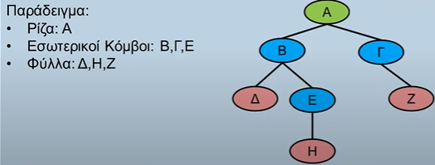

# Δένδρο

## Ορισμός Δένδρου

Το **"Δένδρο"** είναι μια μη γραμμική, ιεραρχική δομή δεδομένων στην οποία:

- Αποτελείται από κόμβους (κορυφές) και ακμές (πλευρές) που ομοιάζουν με ένα (ανάποδο) δένδρο. Οι κόμβοι είναι τριών ειδών:
 - Η **ρίζα** είναι ο μοναδικός κόμβος από τον οποίο μόνο ξεκινούν ακμές
 - Οι **εσωτερικοί κόμβοι** (ή μη τερματικοί) στις οποίες καταλήγουν και ξεκινούν ακμές.
 - Τα **φύλλα** (ή τερματικοί κόμβοι) στα οποία καταλήγει μόνο μία ακμή.

Παράδειγμα:

